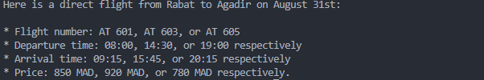

# 🤖 TP Agent MCP — SDIA

Ce projet implémente des **agents LangChain utilisant le protocole MCP (Model Context Protocol)** pour connecter des serveurs d'outils locaux et distants à un agent LLM (Ollama).

---

## 📂 Structure du Labo

- **`mcp_local_server.py`** : Serveur MCP local (stdio) avec un outil de recherche web (Tavily), une ressource (GitHub README) et un prompt système.
- **`mcp_http_server.py`** : Serveur MCP HTTP autonome simulant un service de vols (transport `streamable-http`).
- **`agentMCP.py`** : Agent connecté au **serveur local stdio** — utilise les outils, ressources et prompt du serveur.
- **`agentMCPTime.py`** : Agent connecté au **serveur MCP Time** (`mcp-server-time`) — interroge l'heure dans différents fuseaux horaires.
- **`agentMCPDistant.py`** : Agent connecté à un **serveur MCP HTTP** (démarré en interne dans un thread) — recherche de vols.

---

## ⚙️ Installation des dépendances

```bash
pip install -r requirements.txt
# ou avec uv :
uv sync
```

Pour `agentMCPTime.py`, installer également le serveur MCP Time :

```bash
pip install mcp-server-time
# ou :
uvx install mcp-server-time
```

---

## 🔑 Configuration

Créez un fichier `.env` à partir de `.env.example` :

```bash
TAVILY_API_KEY=your_tavily_api_key_here
OLLAMA_MODEL=llama3.2:3b
```

---

## 🚀 Exécution

### Agent avec serveur local (outils + ressources + prompt)

```bash
python agentMCP.py
```

### Agent avec serveur Time (heure en temps réel)

```bash
python agentMCPTime.py
```

### Agent avec serveur HTTP distant (réservation de vols)

```bash
python agentMCPDistant.py
```

### Serveur HTTP standalone (à lancer séparément si besoin)

```bash
python mcp_http_server.py
```

---

## 🔑 Concepts clés MCP

| Concept                       | Description                                            |
| ----------------------------- | ------------------------------------------------------ |
| **Tool**                      | Fonction exposée par le serveur, appelable par l'agent |
| **Resource**                  | Donnée statique ou dynamique accessible via URI        |
| **Prompt**                    | Template de prompt système défini côté serveur         |
| **Transport stdio**           | Communication via stdin/stdout (serveur local)         |
| **Transport streamable-http** | Communication via HTTP (serveur distant)               |


