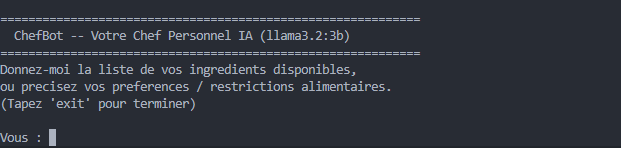

# Chef Personnel Agent -- IA Culinaire

Agent LangChain intelligent jouant le role d'un chef cuisinier personnel.

---

## Fonctionnalites implementees

| Fonctionnalite     | Description                                                                                |
| ------------------ | ------------------------------------------------------------------------------------------ |
| **System Message** | Definit la personnalite et le role du chef (instructions, format de reponse)               |
| **Memoire**        | `InMemorySaver` : retient les preferences, allergies et historique par session             |
| **RAG**            | Base de connaissances culinaires locale (associations, techniques, substitutions, regimes) |
| **Recherche Web**  | Outil Tavily pour trouver des recettes ou techniques specifiques en ligne                  |

---

## Architecture

```
Utilisateur
    |
    v
create_agent (LangChain)
    |-- System Message : personnalite chef + instructions
    |-- InMemorySaver  : memoire de conversation (preferences)
    |
    |-- [Outil 1] recherche_culinaire (RAG)
    |       |-- HuggingFace Embeddings (all-MiniLM-L6-v2)
    |       |-- InMemoryVectorStore
    |       `-- Documents : associations | techniques | substitutions |
    |                       regimes | recettes rapides | conservation
    |
    `-- [Outil 2] recherche_web (Tavily)
            `-- Recherche internet pour recettes specifiques
```

---

## Installation

```bash
pip install -r requirements.txt
```

---

## Configuration

Creez un fichier `.env` a partir de `.env.example` :

```
TAVILY_API_KEY=votre_cle_api
OLLAMA_MODEL=llama3.2:3b
OLLAMA_TEMPERATURE=0
APP_MODE=interactive
```

---

## Execution

### Mode interactif (defaut)

```bash
python chef_personnel_agent.py
```

### Mode demo (scenario automatique)

```bash
APP_MODE=demo python chef_personnel_agent.py
```

Le mode demo illustre les 5 etapes suivantes :

1. **Memoire** : enregistrement du nom et des preferences (allergie aux noix, vegetarienne)
2. **RAG** : association d'ingredients disponibles en plat
3. **RAG** : technique de cuisson recommandee
4. **Web** : recherche d'une recette specifique en ligne
5. **Memoire** : rappel des preferences memorisees (verification)

---

## Exemple de session interactive

```
Vous : Bonjour, je suis allergique aux noix et j'adore la cuisine orientale.
Chef : Bonjour ! J'ai bien note votre allergie aux noix et votre preference pour la cuisine orientale...

Vous : J'ai du poulet, du lait de coco, du riz et des epices.
Chef : Parfait ! Je vous propose un Curry de Poulet au Lait de Coco...
  1. Faire revenir le poulet en morceaux...
  2. ...

Vous : Rappelle-moi mes preferences.
Chef : Bien sur ! Vous m'avez indique etre allergique aux noix et apprecier la cuisine orientale.
```


